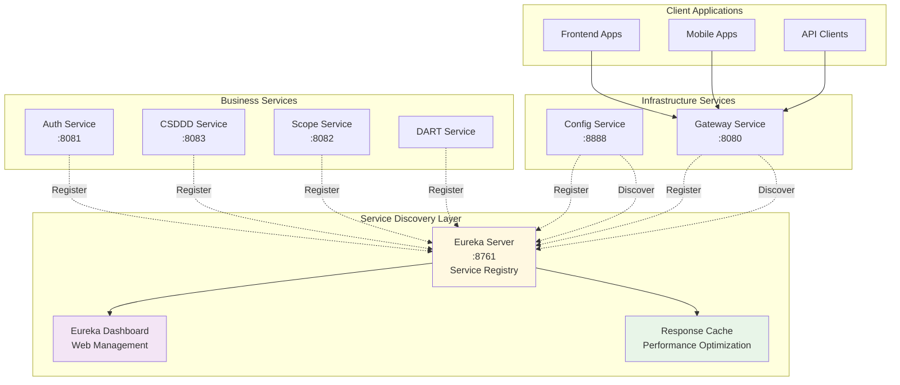
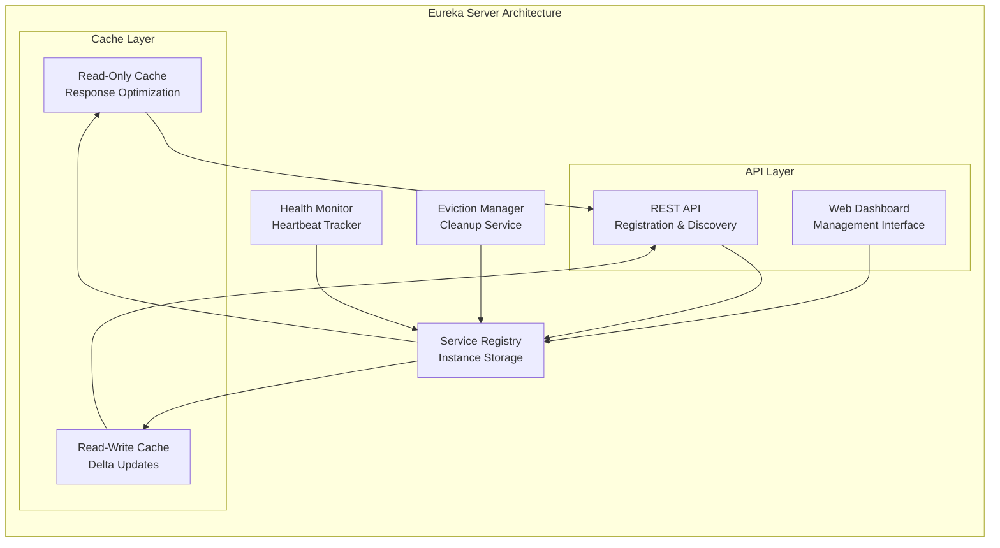
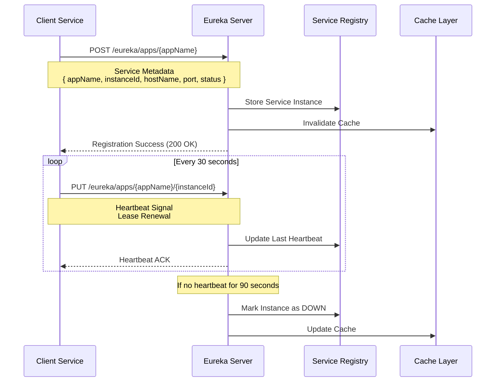
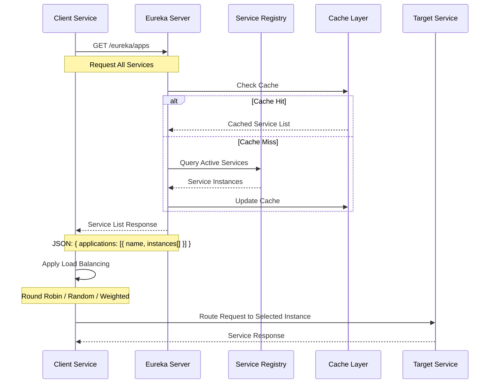
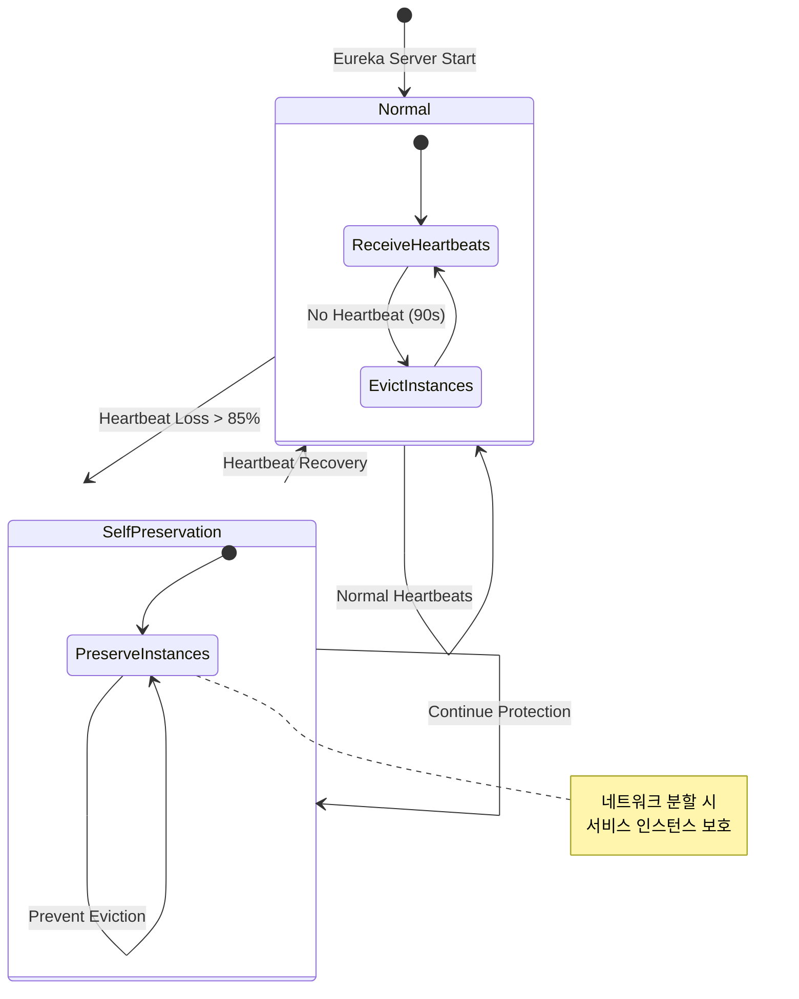

# Discovery Service - Netflix Eureka 기반 서비스 디스커버리

**포트폴리오 프로젝트**: ESG 플랫폼 - 마이크로서비스 서비스 레지스트리 및 디스커버리

## 프로젝트 개요

Discovery Service는 ESG 플랫폼의 **핵심 인프라 컴포넌트**로, Netflix Eureka를 기반으로 한 **서비스 디스커버리 시스템**입니다. 분산 마이크로서비스 환경에서 서비스 간의 **동적 발견, 로드밸런싱, 장애 복구**를 자동화하여 고가용성과 확장성을 보장합니다.

### 핵심 기능

- **동적 서비스 관리**: 서비스 인스턴스의 자동 등록/해제 및 실시간 상태 추적
- **헬스체크 모니터링**: 하트비트 기반 서비스 상태 감지 및 자동 장애 복구
- **클라이언트측 로드밸런싱**: Netflix Ribbon 통합으로 지능형 요청 분산
- **고가용성 보장**: 자체보호 모드 및 멀티 인스턴스 클러스터링 지원
- **운영 대시보드**: 웹 기반 실시간 서비스 현황 모니터링

### 기술 스택

[](https://spring.io/projects/spring-boot)
[](https://spring.io/projects/spring-cloud-netflix)
[](https://spring.io/projects/spring-cloud)
[](https://spring.io/projects/spring-cloud-netflix)

## 시스템 아키텍처

### 마이크로서비스 디스커버리 구조



### Eureka 서버 내부 구조



## 서비스 등록 및 발견 플로우

### 서비스 등록 시퀀스



### 서비스 발견 시퀀스



## 고가용성 및 장애 처리

### 자체보호 모드 (Self-Preservation Mode)



## 성능 최적화

### 캐싱 전략

| Cache Type | Update Interval | Purpose | TTL |
|------------|-----------------|---------|-----|
| **Read-Only Cache** | 30초 | 클라이언트 응답 최적화 | 3분 |
| **Read-Write Cache** | 즉시 | 레지스트리 변경 감지 | 3분 |
| **Delta Cache** | 30초 | 증분 업데이트 | 3분 |

### 네트워크 최적화

```yaml
# 성능 최적화 설정
eureka:
  server:
    # 응답 캐시 업데이트 주기 (30초)
    response-cache-update-interval-ms: 30000
    
    # 읽기 전용 캐시 TTL (3분)
    response-cache-auto-expiration-in-seconds: 180
    
    # 제거 작업 주기 (1초)
    eviction-interval-timer-in-ms: 1000
    
    # 자체 보호 모드 (운영: true, 개발: false)
    enable-self-preservation: false
```

## 설정 및 구성

### Eureka 서버 설정

```yaml
# application.yml
spring:
  application:
    name: discovery-service
  config:
    import: optional:configserver:http://localhost:8888

server:
  port: 8761

eureka:
  server:
    # 자체보호 모드 (개발환경에서는 비활성화)
    enable-self-preservation: false
    
    # 인스턴스 제거 주기
    eviction-interval-timer-in-ms: 1000
    
    # 응답 캐시 설정
    response-cache-update-interval-ms: 30000
    response-cache-auto-expiration-in-seconds: 180

  client:
    # 자기 자신을 Eureka에 등록하지 않음
    register-with-eureka: false
    
    # 다른 Eureka 서버에서 레지스트리를 가져오지 않음
    fetch-registry: false
    
    service-url:
      defaultZone: http://localhost:8761/eureka/

  instance:
    hostname: localhost
    # 하트비트 간격 (개발환경: 5초, 운영환경: 30초)
    lease-renewal-interval-in-seconds: 5
    # 인스턴스 만료 시간 (개발환경: 10초, 운영환경: 90초)
    lease-expiration-duration-in-seconds: 10
```

### 클라이언트 서비스 설정 예시

```yaml
# 다른 마이크로서비스의 Eureka 클라이언트 설정
eureka:
  client:
    service-url:
      defaultZone: http://localhost:8761/eureka/
    
    # 서비스 등록 활성화
    register-with-eureka: true
    
    # 서비스 목록 가져오기 활성화
    fetch-registry: true
    
    # 레지스트리 갱신 주기
    registry-fetch-interval-seconds: 30

  instance:
    # IP 주소 우선 사용
    prefer-ip-address: true
    
    # 하트비트 간격
    lease-renewal-interval-in-seconds: 30
    
    # 인스턴스 만료 시간
    lease-expiration-duration-in-seconds: 90
    
    # 메타데이터
    metadata-map:
      version: "1.0.0"
      environment: "development"
      zone: "zone1"
```

## 모니터링 및 관리

### Eureka 대시보드

**접속 URL**: `http://localhost:8761`

대시보드에서 확인 가능한 정보:
- **등록된 서비스 목록**: 모든 활성 서비스 인스턴스
- **인스턴스 상태**: UP, DOWN, OUT_OF_SERVICE, UNKNOWN
- **서비스 메타데이터**: 버전, 환경, 존 정보
- **시스템 정보**: 메모리 사용량, CPU 사용률
- **레지스트리 통계**: 등록/해제 빈도, 하트비트 통계

### REST API 엔드포인트

| HTTP Method | Endpoint | 설명 | 응답 |
|-------------|----------|------|------|
| GET | `/eureka/apps` | 모든 서비스 목록 조회 | XML/JSON |
| GET | `/eureka/apps/{appName}` | 특정 서비스 인스턴스 조회 | XML/JSON |
| POST | `/eureka/apps/{appName}` | 서비스 인스턴스 등록 | 204 No Content |
| PUT | `/eureka/apps/{appName}/{instanceId}` | 하트비트 전송 | 200 OK |
| DELETE | `/eureka/apps/{appName}/{instanceId}` | 서비스 인스턴스 해제 | 200 OK |

### Actuator 모니터링

```bash
# 서비스 상태 확인
curl http://localhost:8761/actuator/health

# 등록된 서비스 목록 (JSON)
curl -H "Accept: application/json" http://localhost:8761/eureka/apps

# 특정 서비스 정보
curl http://localhost:8761/eureka/apps/auth-service

# 메트릭 정보
curl http://localhost:8761/actuator/metrics
```

## 실행 방법

### 개발 환경 구성

```bash
# 1. Discovery Service가 가장 먼저 실행되어야 함
cd backend/discovery-service
./gradlew bootRun

# 2. Eureka 대시보드 접속 확인
open http://localhost:8761

# 3. 다른 서비스들이 등록되는지 확인
# Config Service, Gateway Service, Auth Service 순으로 실행
```

### 환경 변수 설정

```bash
# 선택적 환경 변수
export EUREKA_SERVER_PORT=8761
export EUREKA_HOSTNAME=localhost

# 클러스터 구성 시
export EUREKA_PEER_URLS="http://eureka1:8761/eureka/,http://eureka2:8761/eureka/"
```

## 테스트

```bash
# 단위 테스트 실행
./gradlew test

# Discovery Service 상태 확인
curl http://localhost:8761/actuator/health

# 서비스 등록 테스트
curl -X POST http://localhost:8761/eureka/apps/test-service \
  -H "Content-Type: application/json" \
  -d '{"instance": {"app": "test-service", "hostName": "localhost", "port": {"$": 8080, "@enabled": "true"}}}'
```

## 핵심 구현 특징

### 1. 서비스 자동 등록 활성화

```java
@EnableEurekaServer
@SpringBootApplication
public class DiscoveryServiceApplication {
    public static void main(String[] args) {
        SpringApplication.run(DiscoveryServiceApplication.class, args);
    }
}
```

### 2. 클라이언트측 로드밸런싱

```java
// 클라이언트 서비스에서 사용
@EnableEurekaClient
@SpringBootApplication
public class ClientApplication {
    
    @LoadBalanced
    @Bean
    public RestTemplate restTemplate() {
        return new RestTemplate();
    }
}

// 서비스 이름으로 호출
restTemplate.getForObject("http://auth-service/api/v1/user", User.class);
```

### 3. 헬스체크 및 장애 감지

- **하트비트 간격**: 30초마다 서비스 상태 전송
- **장애 감지**: 90초 동안 하트비트 없으면 인스턴스 제거
- **자체보호 모드**: 네트워크 분할 시 서비스 보호

### 4. 성능 최적화

- **응답 캐싱**: 자주 요청되는 서비스 목록 캐시
- **델타 동기화**: 변경된 내용만 전송
- **비동기 처리**: 논블로킹 I/O로 높은 처리량

## 확장성 고려사항

### 멀티 존 배포

```yaml
# 가용 영역별 Eureka 서버 배치
eureka:
  client:
    service-url:
      zone1: http://eureka-zone1:8761/eureka/
      zone2: http://eureka-zone2:8761/eureka/
    availability-zones:
      region1: zone1,zone2
```

### 피어 투 피어 복제

```yaml
# Eureka 서버 클러스터 설정
eureka:
  client:
    register-with-eureka: true
    fetch-registry: true
    service-url:
      defaultZone: http://peer1:8761/eureka/,http://peer2:8762/eureka/
```

## 주요 특징

- **확장성**: 멀티 인스턴스 클러스터링으로 수평 확장 지원
- **안정성**: 자체보호 모드와 피어 복제로 고가용성 보장
- **성능**: 캐싱 전략과 델타 동기화로 빠른 응답 시간
- **모니터링**: 웹 대시보드와 REST API로 실시간 관리
- **유연성**: 메타데이터 기반 서비스 분류 및 라우팅

---

**기술적 성과**:
- Netflix Eureka 기반 엔터프라이즈급 서비스 디스커버리 구현
- 자체보호 모드와 헬스체크를 통한 고가용성 서비스 레지스트리 설계
- 클라이언트측 로드밸런싱과 캐싱 전략으로 성능 최적화
- 마이크로서비스 간 동적 서비스 발견 및 장애 복구 자동화

