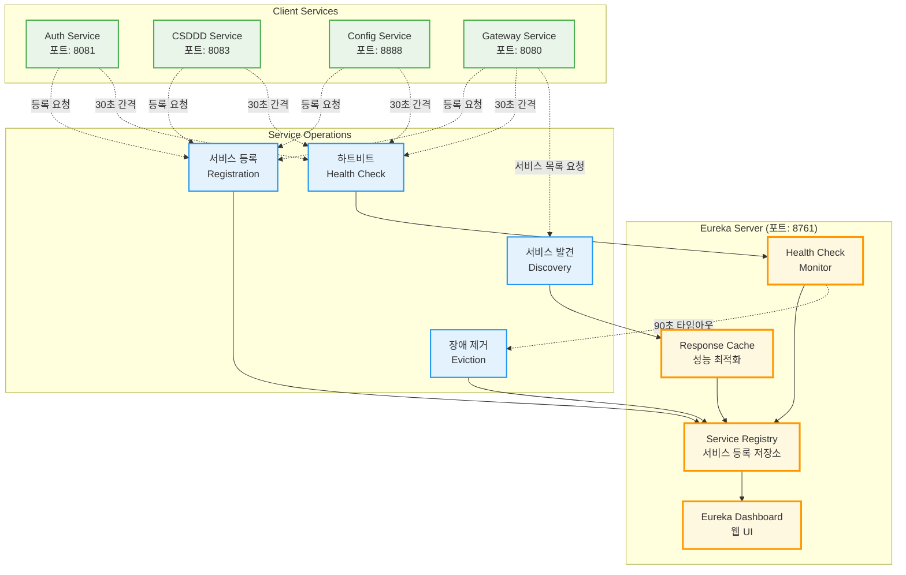
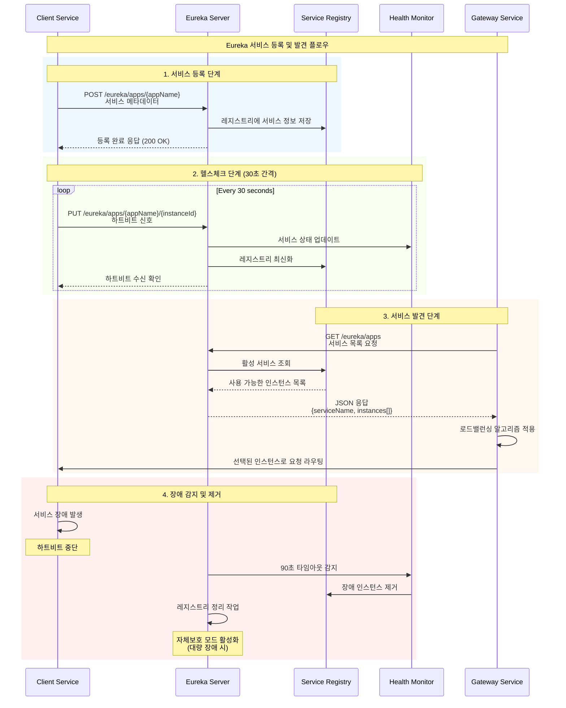

# 🌐 ESG Discovery Service - 마이크로서비스 서비스 디스커버리

> **Netflix Eureka 기반 서비스 레지스트리**

[](https://spring.io/projects/spring-boot)
[](https://spring.io/projects/spring-cloud)
[](https://github.com/Netflix/eureka)
[](https://openjdk.java.net/projects/jdk/17/)

## 📋 프로젝트 개요

ESG Discovery Service는 **마이크로서비스 아키텍처의 핵심 인프라 컴포넌트**로, Netflix Eureka를 기반으로 한 서비스 디스커버리 시스템입니다. 분산 환경에서 서비스 간의 동적 발견, 로드밸런싱, 장애 복구를 자동화합니다.

### 🎯 핵심 해결 과제

- **동적 서비스 관리**: 서비스 인스턴스의 자동 등록/해제
- **고가용성 보장**: 서비스 장애 감지 및 자동 복구
- **확장성 지원**: 무중단 서비스 스케일링
- **로드밸런싱**: 클라이언트측 지능형 요청 분산
- **중앙 집중식 관리**: 단일 레지스트리를 통한 서비스 현황 파악

### 🏗️ Eureka Server 중심 아키텍처



## 🔄 Eureka 서비스 등록 및 발견 플로우



## 🛠️ 기술 스택

### Core Framework

- **Spring Boot 3.5.0** - 최신 엔터프라이즈 프레임워크
- **Spring Cloud 2025.0.0** - 마이크로서비스 인프라 지원
- **Netflix Eureka Server** - 검증된 서비스 디스커버리 솔루션

### Service Discovery Features

- **동적 서비스 등록** - 자동 서비스 인스턴스 발견
- **헬스체크 메커니즘** - 실시간 서비스 상태 모니터링
- **자체보호 모드** - 네트워크 분할 시 서비스 보호
- **메타데이터 관리** - 서비스별 커스텀 정보 저장

### Monitoring & Management

- **Spring Boot Actuator** - 운영 메트릭 수집
- **Eureka Dashboard** - 웹 기반 서비스 현황 대시보드
- **JMX 통합** - 시스템 모니터링 도구 연동

### Development Tools

- **Spring Boot DevTools** - 개발 생산성 향상
- **Lombok** - 보일러플레이트 코드 최소화

## 🏢 서비스 디스커버리 패턴

### 클라이언트측 디스커버리

```java
// Eureka 클라이언트 자동 구성
@EnableEurekaClient
@SpringBootApplication
public class ClientServiceApplication {

    @LoadBalanced
    @Bean
    public RestTemplate restTemplate() {
        return new RestTemplate();
    }
}

// 서비스 이름으로 호출
restTemplate.getForObject("http://auth-service/api/v1/user", User.class);
```

### 서버측 서비스 등록

```java
// Eureka 서버 활성화
@EnableEurekaServer
@SpringBootApplication
public class DiscoveryServiceApplication {
    public static void main(String[] args) {
        SpringApplication.run(DiscoveryServiceApplication.class, args);
    }
}
```

## 📊 핵심 기능

### 1. 자동 서비스 등록/해제

- ✅ **부팅 시 자동 등록**: 서비스 시작과 동시에 Eureka 서버에 등록
- ✅ **그레이스풀 셧다운**: 정상 종료 시 서비스 해제 신호 전송
- ✅ **메타데이터 관리**: 버전, 환경, 태그 정보 포함

### 2. 헬스체크 및 장애 감지

- ✅ **하트비트 모니터링**: 30초 간격 상태 확인
- ✅ **장애 인스턴스 제거**: 90초 타임아웃 후 자동 제거
- ✅ **자체보호 모드**: 대량 장애 시 서비스 보호

### 3. 로드밸런싱 지원

- ✅ **클라이언트측 로드밸런싱**: Ribbon 통합
- ✅ **다양한 알고리즘**: Round Robin, Random, 가중치 기반
- ✅ **장애 인스턴스 회피**: 자동 트래픽 우회

### 4. 고가용성 보장

- ✅ **다중 Eureka 서버**: 클러스터링 지원
- ✅ **피어 복제**: 서버 간 레지스트리 동기화
- ✅ **분할 뇌 방지**: Quorum 기반 합의

## 🔧 서비스 설정

### Eureka 서버 설정

```yaml
server:
  port: 8761

eureka:
  server:
    enable-self-preservation: false # 개발환경: 빠른 인스턴스 제거
    eviction-interval-timer-in-ms: 1000 # 제거 주기: 1초
    response-cache-update-interval-ms: 30000 # 캐시 갱신: 30초

  client:
    register-with-eureka: false # 자기 자신 등록 안함
    fetch-registry: false # 다른 서버에서 레지스트리 가져오지 않음

  instance:
    hostname: localhost
    lease-renewal-interval-in-seconds: 5 # 하트비트 간격
    lease-expiration-duration-in-seconds: 10 # 만료 시간
```

### 클라이언트 설정 예시

```yaml
eureka:
  client:
    service-url:
      defaultZone: http://localhost:8761/eureka/
    fetch-registry: true
    register-with-eureka: true
    registry-fetch-interval-seconds: 30

  instance:
    prefer-ip-address: true
    lease-renewal-interval-in-seconds: 30
    lease-expiration-duration-in-seconds: 90
    metadata-map:
      version: 1.0.0
      environment: development
```

## 🚀 성능 최적화

### 1. 네트워크 최적화

- **지역별 Eureka 서버**: 네트워크 지연 최소화
- **응답 캐싱**: 자주 요청되는 서비스 목록 캐시
- **델타 동기화**: 변경된 내용만 전송

### 2. 메모리 최적화

- **압축 통신**: 레지스트리 데이터 압축 전송
- **TTL 기반 캐싱**: 메모리 사용량 제어
- **가비지 컬렉션 튜닝**: JVM 최적화

### 3. 장애 복구 최적화

- **빠른 장애 감지**: 개발환경 1초, 운영환경 30초
- **그레이스풀 셧다운**: 서비스 무중단 업데이트
- **서킷 브레이커**: 연쇄 장애 방지

## 📈 확장성 고려사항

### 1. 수평 확장

- **멀티 존 배포**: 가용 영역별 Eureka 서버 배치
- **피어 투 피어 복제**: 서버 간 자동 동기화
- **로드밸런서 연동**: 외부 LB와 통합

### 2. 대용량 처리

- **배치 등록**: 대량 서비스 일괄 등록
- **비동기 처리**: 논블로킹 I/O 활용
- **연결 풀링**: HTTP 커넥션 재사용

### 3. 보안 강화

- **SSL/TLS**: 암호화 통신
- **인증/인가**: Spring Security 통합
- **네트워크 격리**: VPC 내부 통신

## 🔍 모니터링 및 운영

### Eureka 대시보드

- **서비스 현황**: 등록된 모든 서비스 실시간 조회
- **인스턴스 상태**: 각 인스턴스별 헬스 상태 확인
- **메타데이터**: 서비스별 추가 정보 조회

### Actuator Endpoints

```bash
# 서비스 상태 확인
curl http://localhost:8761/actuator/health

# 등록된 서비스 목록
curl http://localhost:8761/eureka/apps

# 특정 서비스 정보
curl http://localhost:8761/eureka/apps/auth-service

# 메트릭 정보
curl http://localhost:8761/actuator/metrics
```

### 로깅 전략

```yaml
logging:
  level:
    com.netflix.eureka: DEBUG
    com.netflix.discovery: DEBUG
  pattern:
    console: "%d{HH:mm:ss.SSS} [%thread] %-5level %logger{36} - %msg%n"
  file:
    name: logs/discovery-service.log
```

## 🧪 실제 사용 예시

### 서비스 등록 확인

```bash
# 등록된 모든 서비스 조회
curl http://localhost:8761/eureka/apps | grep -E "application|status"

# JSON 형태로 서비스 목록 조회
curl -H "Accept: application/json" http://localhost:8761/eureka/apps
```

### 특정 서비스 인스턴스 조회

```bash
# Auth Service 인스턴스 목록
curl http://localhost:8761/eureka/apps/auth-service

# 서비스 상태 확인
curl http://localhost:8761/eureka/apps/auth-service/auth-service-instance-1
```

### 클라이언트에서 서비스 호출

```java
@RestController
public class ClientController {

    @Autowired
    private DiscoveryClient discoveryClient;

    @GetMapping("/services")
    public List<String> getServices() {
        return discoveryClient.getServices();
    }

    @GetMapping("/instances/{serviceName}")
    public List<ServiceInstance> getInstances(@PathVariable String serviceName) {
        return discoveryClient.getInstances(serviceName);
    }
}
```

## 🛠️ 개발 환경 설정

### 로컬 실행

```bash
# 1. 프로젝트 클론 후 이동
cd backend/discovery-service

# 2. 애플리케이션 실행
./gradlew bootRun

# 3. Eureka 대시보드 접속
open http://localhost:8761
```

이 Discovery Service는 **엔터프라이즈급 마이크로서비스 인프라**의 핵심 구성요소로서 다음과 같은 기술적 특징을 가집니다:

**핵심 기술적 성과:**

- 🌐 **서비스 디스커버리**: Netflix Eureka 기반 동적 서비스 관리
- 🔄 **자동 장애 복구**: 하트비트 기반 실시간 헬스체크
- ⚡ **고성능 로드밸런싱**: 클라이언트측 지능형 요청 분산
- 🛡️ **고가용성**: 자체보호 모드 및 멀티 인스턴스 지원
- 📊 **운영 모니터링**: 실시간 대시보드 및 메트릭 수집

---
